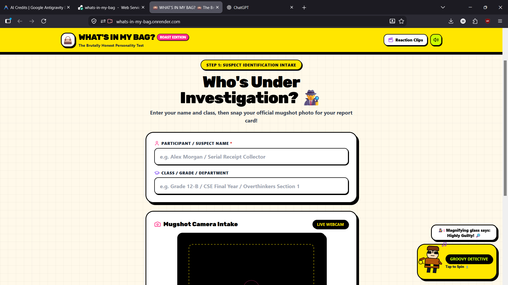
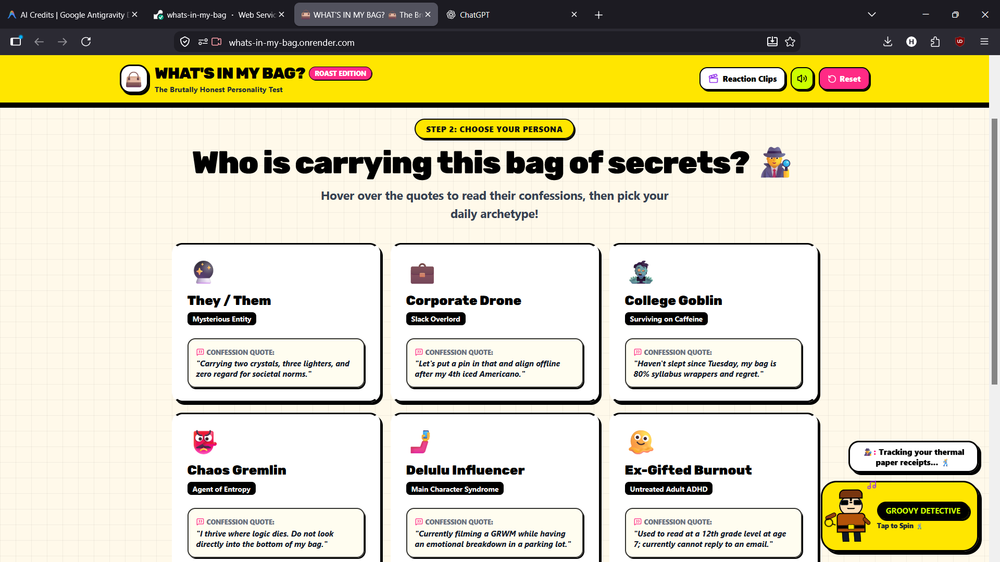
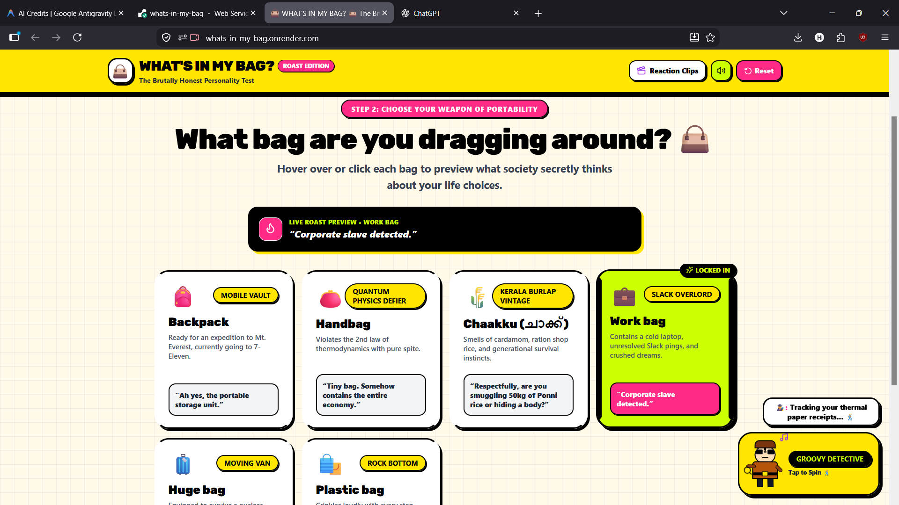
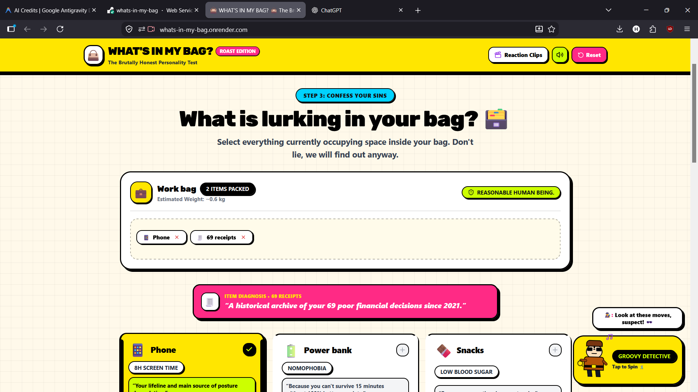
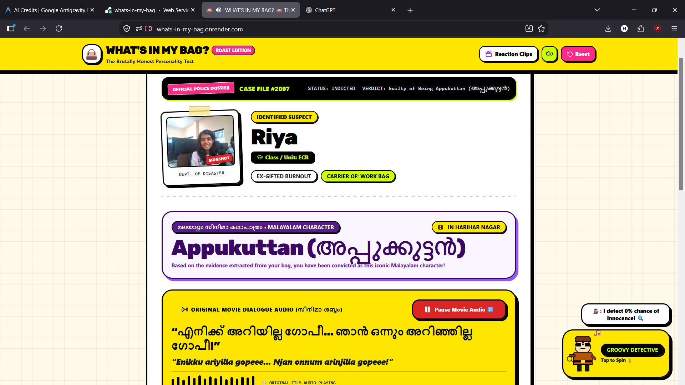
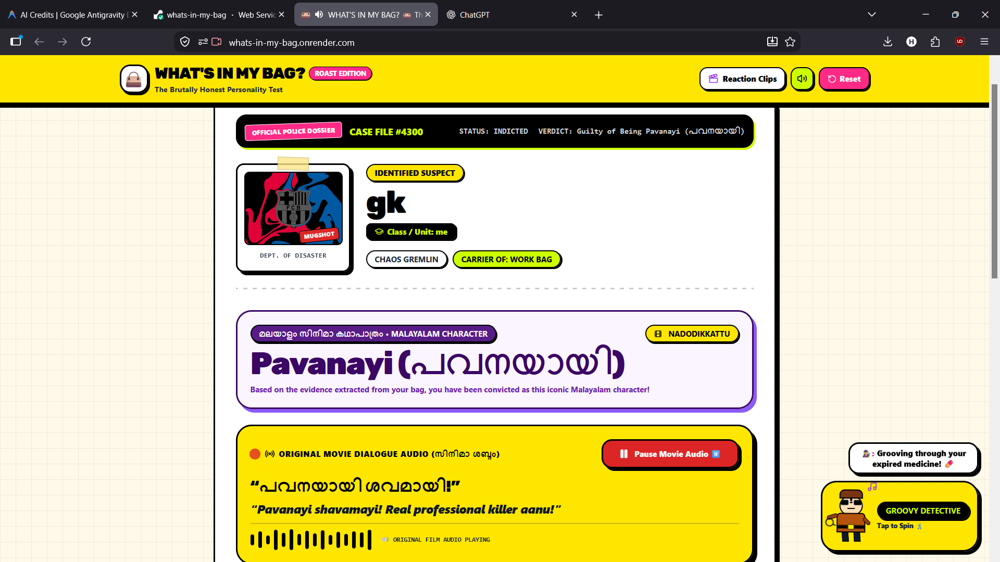

# Personality in my bag

## Basic Details
### Team Name: Nothing 

### Team Members
- Team Lead: Riya Elizabeth Kurian - Govt Model Engineering College
- Member 2: Goutham Krishna - Govt Model Engineering College

### Project Description
An AI-based system that analyzes the items in a person’s bag to identify their interests, habits, and lifestyle. It then uses these patterns to generate a fun, personalized personality profile.

### The Problem (that doesn't exist)
I’m solving the ridiculous problem of not knowing what your bag says about your personality.

### The Solution (that nobody asked for)
 My website lets users enter the contents of their bag and generates a funny, personalized roast based on their items. Because apparently, your emergency snacks, tangled earphones, and random receipts are enough to expose your entire personality.
 
## Technical Details
### Technologies/Components Used
For Software:
- Javascript,CSS,HTML
- React 
- react, react-dom, lucide-react, html-to-image, canvas-confetti, tailwindcss, autoprefixer, autoprefixer, postcss, vite, @vitejs/plugin-react, express, @google/generative-ai, cors , dotenv
- [Tools used]

### Implementation
For Software:
# Installation
npm install

# Run
npm run dev

### Project Documentation
For Software:

# Screenshots (Add at least 3)
### Screenshot 1 — Home Page

The landing page of BagPersona where users can start the analysis.

### Screenshot 2 — Bag Upload

Users upload an image of their bag for personality analysis.

### Screenshot 3 — Image Analysis

The uploaded bag image is processed by the system.

### Screenshot 4 — Detected Items

The system identifies the objects present in the bag.

### Screenshot 5 — Personality Analysis

The detected items are analyzed to infer personality traits.

### Screenshot 6 — Final Result

The final personalized personality profile generated from the bag contents.

# Diagrams

*Add caption explaining your workflow*

For Hardware:

### Project Demo
# Video
[Add your demo video link here]
*Explain what the video demonstrates*

# Additional Demos
[Add any extra demo materials/links]

Made with ❤️ at TinkerHub Useless Projects 

